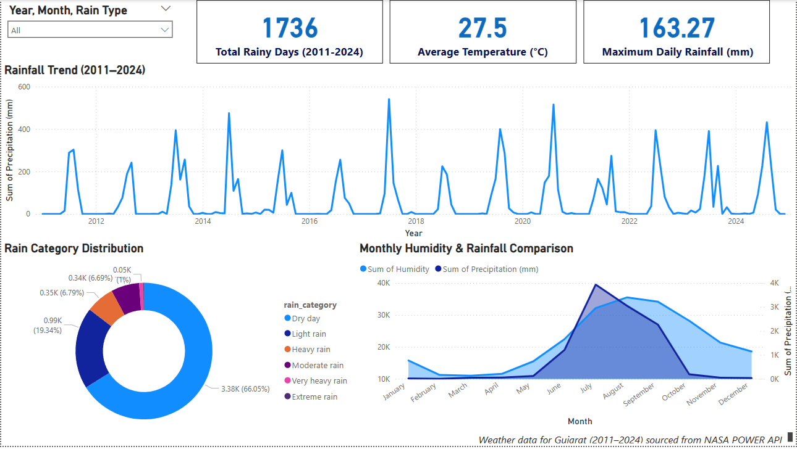

# rainfall-classification-nasa-gujarat
Rainfall prediction for Gujarat, India (2011–2024) using weather data from NASA POWER API and machine learning models.

# ☔ Rainfall Prediction in Gujarat, India (2011–2024)


> 📊 *Interactive dashboard built in Power BI showcasing rainfall trends, humidity comparison, and rainfall category distribution.*


This project builds a Machine Learning model to **predict daily rainfall occurrence** (`rain = yes/no`) using historical weather data sourced from NASA’s POWER API. It demonstrates a complete end-to-end data science workflow, from API data collection to feature engineering, model building, evaluation, and interpretation.

---

## 📦 Dataset Details

- **📡 Source:** [NASA POWER API](https://power.larc.nasa.gov/)
- **📍 Location:** Gujarat, India  
- **🧭 Coordinates:** Latitude: 23.223, Longitude: 72.650  
- **📆 Timeline:** January 2011 – December 2024 (5114 days)
- **🎯 Task:** Binary Classification (Rain = Yes or No)

---

## 🔍 Project Highlights

### ✅ Objectives
- Fetch daily weather data from NASA’s API
- Conduct Exploratory Data Analysis (EDA)
- Perform feature engineering and selection
- Train and evaluate classification models
- Fine-tune hyperparameters to maximize performance

### 📊 Key Features Used

| Feature        | Description                        |
|----------------|------------------------------------|
| `T2M`          | Average temperature (°C)           |
| `T2M_MAX`      | Maximum temperature (°C)           |
| `T2M_MIN`      | Minimum temperature (°C)           |
| `RH2M`         | Relative humidity (%)              |
| `WS2M`         | Wind speed at 2 meters (m/s)       |
| `WD2M`         | Wind direction at 2 meters (°)     |
| `PS`           | Surface pressure (kPa)             |
| `PRECTOTCORR`  | Precipitation (mm/day)             |
| `day`          | Date (in YYYYMMDD format)          |

---

## ⚙️ Techniques Used

- 📡 **API Integration** – Real-time NASA POWER API
- 📊 **EDA** – Histograms, boxplots, KDE plots, wind rose
- 🧠 **Machine Learning** – Logistic Regression, SVM, Decision Tree, KNN
- 🧪 **Feature Engineering** – Direction binning, seasonal features
- 🧹 **Feature Scaling & Selection** – StandardScaler, RFE
- 🧮 **Model Evaluation** – AUC-ROC, precision, recall, F1-score
- 🔧 **Hyperparameter Tuning** – GridSearchCV (cross-validation)

---

## 📈 Model Performance

| Metric              | Value     |
|---------------------|-----------|
| **ROC-AUC Score**   | 0.9609 ✅  |
| **Accuracy**        | 90.0%     |
| **Precision (Dry)** | 0.94      |
| **Recall (Rain)**   | 0.91      |
| **F1 Score (Rain)** | 0.87      |

> The model shows excellent discrimination ability, strong recall for rainy days, and reliable precision for dry days. It is well-suited for real-world rainfall prediction tasks.

## 📁 Project Structure

```
rainfall-classification-nasa-gujarat/
├── 00_README.md # ✅ Overview, insights, setup
├── 01_rainfall_prediction_final.ipynb # 📓 Complete pipeline: Fetch → EDA → Modeling
├── 02_Gujarat_Rainfall_Dashboard.pdf # 📊 PDF snapshot of Power BI dashboard
├── 03_Gujarat Rainfall Dashboard.pbix # 🧩 Power BI source file (editable)
├── dashboard_preview.png # 📷 Dashboard image preview for README

```


## 🌦️ Real-World Applications

- **Agriculture** – Predict rainfall for crop irrigation and sowing schedules
- **Disaster Management** – Early warnings for heavy rainfall events
- **Water Resource Planning** – Monitor seasonal rainfall patterns

---


## 👤 Author

**Rahul Arya**  
Aspiring Data Scientist | B.Sc. Physics | IBM & Stanford ML Certified  
🔗 [LinkedIn](https://www.linkedin.com/in/rahul-arya--1810zoro) • [GitHub](https://github.com/rahularya3749)

---

## ✅ Acknowledgements

- NASA POWER API – for freely accessible, high-quality climate data
- IBM Data Science Capstone – for the project framework and structure
- scikit-learn, pandas, seaborn – for modeling and visualization

---

## 📌 Note

> This notebook highlights a real-world ML workflow with a high-performing model ready for deployment or further research. Ideal for portfolios targeting roles in Data Science, Climate Analytics, or AI for Social Good.
